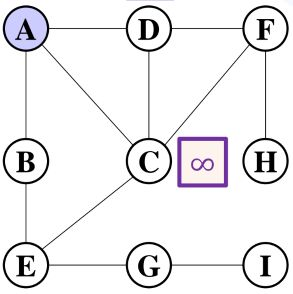

# 图最短路

## 无权图

无权图的路径长度完全取决于路径上的节点数量

### 基于BFS的无权图最短路径算法

#### 算法思想

从源点出发,按照广度优先搜索,可以遍历所有距离为1的点,然后再从这些点遍历到所有距离为2的点,并且对于最短路径(a,b,c,d,e,f),f到d,d到a一定都是最短路.

于是我们可以通过广度优先遍历,求得源点到其它所有点的最短路

我们对下面这张图进行BFS



首先从A开始,得到B,C,D的最短路都是1,路径为A->B,A->C,A->D,然后我们继续遍历,得到B->E,D->F也为1,所以我们得到了E的最短路,A->D->F,路径长度为2

#### 算法实现

+ 首先初始化两个辅助数组,path和dist,其中,path[i]表示i点在最短路径中的上一个顶点,-1表示无上一顶点,初始化为-1;dist[i]表示到i的最短距离,源点初始化为0,其余节点初始化为无穷大(一般用int的limit或者0x3f3f3f3f)
+ 从源点开始进行BFS,将邻接的节点path改为当前节点,dist为当前节点的最短距离加一

```c++
void graph::shortPath(int index)
    {
        int n = nodes.size();
        const int INF = 0x3f3f3f3f;
        vector<int> dist(n, INF); // 最短路径长
        vector<int> path(n, -1);  // 最短路径中的上一节点
        dist[index] = 0;
        queue<int> que; // 辅助队列

        que.push(index);
        while (!que.empty())
        {
            int now = que.front();
            que.pop();
            for_each(nodes[now].link.begin(), nodes[now].link.end(), [&](const linknode &a)
                     {
                if(dist[a.index] == INF)//确保未被访问过
                {
                    path[a.index] = now;
                    dist[a.index] = dist[now] + 1;
                    que.push(a.index);
                } });
        }

        for_each(nodes.begin(), nodes.end(), [](const node &a)
                 { cout << a.data << " "; });
        cout << endl;
        for_each(dist.begin(), dist.end(), [](int a)
                 { cout << a << " "; });
        cout << endl;
        for_each(path.begin(), path.end(), [&](int a)
                 { cout << nodes[a].data << " "; });
        cout << endl;
    }

```

运行结果:

    A B C D E F G H I
    1 2 1 0 2 1 3 2 4
    D A D   C D E F G

## 正权图

### Dijkstra算法

#### 算法思想

与BFS相同,运用了一个定理

    对于ab间的最短路径,路径上的任意两点v1 v2之间一定也是最短距离

在Dijkstra算法中

1. 首先把源点u放入集合S,记录Di记录源点u到顶点i的最短距离,初始时令Di = INF,Du = 0
2. 从集合`V-S`中挑选一个点v,并且S中一个点s,使得`weight(v,s) + Ds`最短,`Dv = weight(v,s) + Ds`
3. 挑选后,对于`V - S`中的各个顶点i,如果`weight(v,i) + Dv < Di`,则更新Di,`Di = weight(v,i) + Dv`
4. 重复2,3操作,直到`S = V`

#### 算法实现

需要引入3个辅助数组:

1. dist[],记录源点到各点的最短距离,源点初始为0,其余各点初始为INF
2. pre[],记录最短距离中当前顶点的上一个点,初始为-1
3. S[],记录当前顶点是否在S中


代码如下:

```c++
    void graph::Dijkstra(int index)
    {
        int n = nodes.size();
        const int INF = 0x3f3f3f3f;
        vector<int> dist(n, INF);
        vector<int> pre(n, -1);
        vector<int> S(n, 0);
        dist[index] = 0;

        auto findMin = [&]() -> int
        {
            int min_index = -1;
            int min = INF;
            for (int i = 0; i < n; i++)
            {
                if (S[i] == 0 && dist[i] < min)
                {
                    min_index = i;
                    min = dist[i];
                }
            }
            return min_index;
        };

        for (int i = 0; i < n; i++)
        {
            int now = findMin();
            if (now == -1)
            {
                return; // 图不连通,剩下的点源点都不可及,结束算法
            }
            S[now] = 1;
            for_each(nodes[now].link.begin(), nodes[now].link.end(), [&](linknode &a)
                     {
                if(S[a.index] == 0 && dist[now] + a.weight < dist[a.index])
                {
                    dist[a.index] = dist[now] + a.weight;
                    pre[a.index] = now;
                } }); // 只需要更新邻接的点
        }
    }
```

算法执行结果:

|index|0|1|2|3|4|
|:---:|:---:|:---:|:---:|:---:|:---:|
|pre|-1|0|-1|-1|0|
|dist|0|3|INF|INF|30|
|S|1|0|0|0|0|

|index|0|1|2|3|4|
|:---:|:---:|:---:|:---:|:---:|:---:|
|pre|-1|0|1|1|0|
|dist|0|3|28|11|30|
|S|1|1|0|0|0|

|index|0|1|2|3|4|
|:---:|:---:|:---:|:---:|:---:|:---:|
|pre|-1|0|3|1|3|
|dist|0|3|15|11|23|
|S|1|1|0|1|0|

|index|0|1|2|3|4|
|:---:|:---:|:---:|:---:|:---:|:---:|
|pre|-1|0|3|1|3|
|dist|0|3|15|11|23|
|S|1|1|1|1|0|

|index|0|1|2|3|4|
|:---:|:---:|:---:|:---:|:---:|:---:|
|pre|-1|0|3|1|3|
|dist|0|3|15|11|23|
|S|1|1|1|1|1|

成功找出了源点到各点的最短路径

#### 算法优化

可以用优先队列来优化

用斐波纳契堆优化效果最佳,但不易实现


## 权图

### Bellman Ford算法

