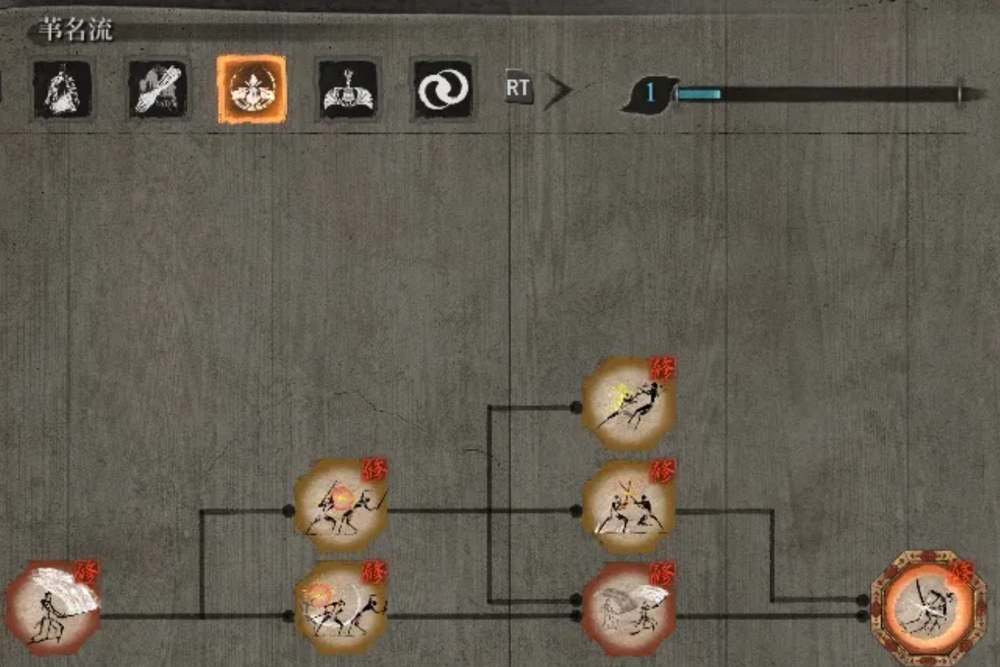
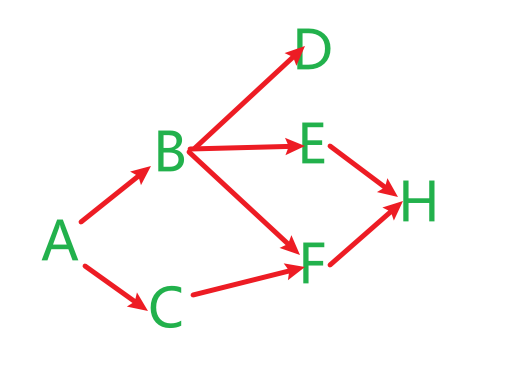
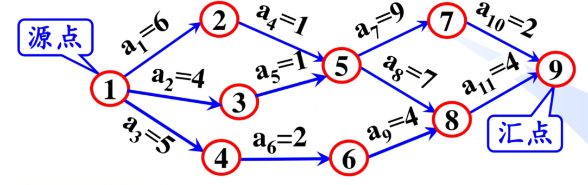

# 拓扑排序&关键路径

## 前置知识

+ 有时一个任务可以拆分成若干个子任务
+ 子任务间存在一些先后关系,必须完成前置任务,才能进行当前任务

例如游戏中的技能树



    只狼中的苇名流派招式,必须从一字斩学起,学会前置招式(一字斩,下鲤,登鲤,躯干吐息,流水,一字斩-二连)才能学习 绝技·苇名十字斩

### AOV网

在有向图中,顶点表示活动,有向边表示先后关系,这样的有向图即为`AOV网`(Activity On Vertex Network)

+ 如果AOV网中存在边E(i,j),则表示,做j之前必须完成i
+ AOV网中不能有回路,一个任务不能以自己为先决条件.AOV是一个`有向无环图`

对于上面的韦名流招式,可以抽象成一个AOV网,我们用字母表示招式



### 拓扑排序

**拓扑序列** : AOV网中的顶点排成的线性序列,并且在这个序列中,如果i排在j前面,那么一定不存在边j->i;反之,如果存在i->j,则拓扑序列中i一定在j前面

拓扑排序即为求得拓扑序列的过程,帮助决定完成任务的次序

如果得不到拓扑序列,则该AOV网不合法,存在环,无法完成任务

## 拓扑排序的算法实现

### 拓扑序
拓扑排序算法过程如下:

1. 从图中选择一个入度为0的点,加入拓扑序列
2. 删除这条边及其引出的所有边
3. 重复以上过程,直到完成拓扑序列或者不存在入度为0的点(有向图不合法)

    拓扑序列未必唯一

代码实现:

```c++
    void topoOrder() // 拓扑排序
    {
        int n = nodes.size();
        vector<int> inDegree(n, 0); // 记录各点入度
        stack<int> sta;             // 辅助栈
        for_each(nodes.begin(), nodes.end(), [&](node &now)
                 {
            for(linknode& i : now.link)
            {
                inDegree[i.index]++;
            } }); // 统计各点入度

        for (int i = 0; i < n; i++)
        {
            if (inDegree[i] == 0)
            {
                sta.push(i); // 入度为0的点入栈
            }
        }

        while (!sta.empty())
        {
            int index = sta.top();
            sta.pop();
            cout << nodes[index].data << " ";
            for (linknode &i : nodes[index].link)
            {
                inDegree[i.index]--; // 减少入度,模拟删除边的操作
                if (inDegree[i.index] == 0)
                {
                    sta.push(i.index); // 入度为0的点入栈
                }
            }
        }
        cout << endl;
    }
```

对上面的AOV网进行测试:

    A C B F E H D

输出的是合法的拓扑排序

### 逆拓扑序

特殊地,深度优先遍历可以生成逆拓扑序
对于i->j,深度优先遍历可以保证先遍历到j再遍历i,类似二叉树后序遍历

```c++
    void dfs_in(vector<int> &traversaled, int index)
    {
        traversaled[index] = 1; // 标记为已访问
        for (linknode &i : nodes[index].link)
        {
            if (traversaled[i.index] == 0)
            {
                dfs_in(traversaled, i.index);
            }
        }
        cout << nodes[index].data << " ";
    }
    void re_topoOrder()
    {
        int n = nodes.size();
        vector<int> traversaled(n, 0);
        dfs_in(traversaled, 0);
        cout << endl;
    }
```

运行结果:

    D H E F B C A


## 关键路径的概念

AOV网可以加权,表示活动所需的时间

AOV网中有些活动可以并行,有些必须顺序进行

**源点**表示开始(入度为0)

**汇点**表示结束(出度为0)

从源点到汇点的路径会不止一条, 路径长度有所不同

只有各条路径的活动都完成了,才算任务完成,完成任务的时间取决于源点到汇点的最长路径长度,这条路径即为`关键路径(Cirtical Path)`

关键路径上的活动成为`关键活动`



