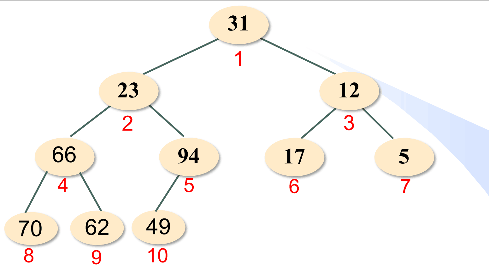
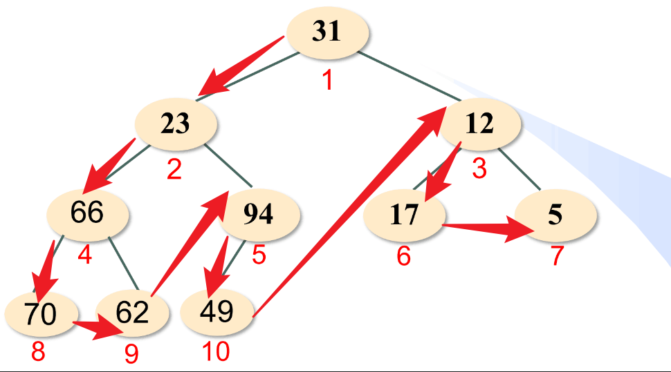
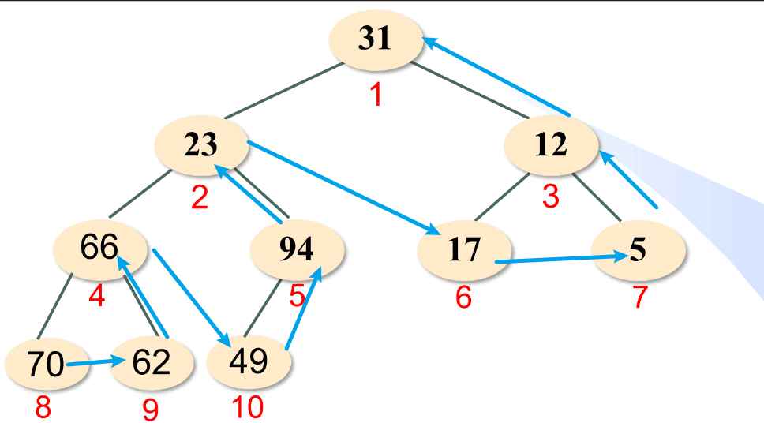

# 二叉树基础

## 存储结构

### 顺序存储
二叉树的结构可以天然对应顺序存储



对于图示的二叉树,可以对应成:

| data  |   0   |  31   |  23   |  12   |  66   |  94   |  17   |   5   |  70   |  62   |  49   |
| :---: | :---: | :---: | :---: | :---: | :---: | :---: | :---: | :---: | :---: | :---: | :---: |
| index |   0   |   1   |   2   |   3   |   4   |   5   |   6   |   7   |   8   |   9   |  10   |

如果一个节点i存在左孩子,那么在`[2*i]`位置,如果存在右孩子,那么在`[2*i+1]` 

如果一个节点i有双亲,那么在`i//2`的位置

这种存储方式适合**完全二叉树**,对于非完全的二叉树,会浪费大量存储空间

### 链式存储
各节点的关系用指针串联起来

```c++
struct node
{
    int data;
    node *leftChild;
    node *rightChild;
    node *parent;//父节点,可选
};
```

## 遍历

接下来使用不同遍历方式来遍历如图二叉树


先构建这个二叉树:
```c++
#include <iostream>
#include <stack>
#include <queue>
using namespace std;

struct node
{
    char data;
    node *leftChild;
    node *rightChild;
    node(char data)
        : 
        data(data), 
        leftChild(nullptr), 
        rightChild(nullptr) {}
};

struct binary_tree
{
    node *root;
};

int main()
{
    binary_tree tree;
    tree.root = new node('A');

    tree.root->leftChild = new node('B');
    tree.root->rightChild = new node('E');

    tree.root->leftChild->rightChild = new node('C');

    tree.root->leftChild->rightChild->leftChild = new node('D');

    tree.root->rightChild->leftChild = new node('F');

}

```

### 先根遍历

#### 递归版本
```c++
void preorder(node *nownode)
{
    if (nownode == nullptr)
    {
        return;
    }
    cout << nownode->data << " ";
    preorder(nownode->leftChild);
    preorder(nownode->rightChild);
}
```

遍历结果:

    A B C D E F

#### 无递归版本:
可以用栈来模拟递归过程:
```c++
void binary_tree::preorder()
{
    stack<node *> sta;
    sta.push(root);
    while (!sta.empty())
    {
        node* nownode = sta.top();
        if(nownode != nullptr)
        {
            cout << nownode->data << " ";
            sta.pop();
            sta.push(nownode->rightChild);
            sta.push(nownode->leftChild);//后进先出,后让右子树入栈
        }
        else
        {
            sta.pop();
        }
    }
    cout<<endl;
}
```

此外,可以思考:


如图,前序遍历总是先遍历依次遍历左子树,到叶子节点之后再遍历其父节点的右子树,因此可以设计算法:

1. 先将根节点入栈
2. 每次从栈中弹出一个元素,依次遍历左子树,遍历时将右子树入栈,直到叶子节点
   
```c++
void binary_tree::preorder2()
{
    stack<node *> sta;
    sta.push(root);
    while (!sta.empty())
    {
        node* nownode = sta.top();
        sta.pop();
        while(nownode != nullptr)
        {
            cout << nownode->data << " ";
            sta.push(nownode->rightChild);
            nownode = nownode->leftChild;
        }
    }
}
```


### 中根遍历

#### 递归版本
```c++
void inorder(node *nownode)
{
    if (nownode == nullptr)
    {
        return;
    }
    inorder(nownode->leftChild);
    cout << nownode->data << " ";
    inorder(nownode->rightChild);
}
```

遍历结果:

    B D C A F E

#### 无递归版本:


中根遍历即先从最左侧的通路自下而上访问,然后再对沿途节点访问,并对其右子树执行这个操作
```c++
void binary_tree::inorder()
{
    stack<node *> sta;
    node *nownode = root;
    while (1)
    {
        while (nownode != nullptr)
        {
            sta.push(nownode);
            nownode = nownode->leftChild; // 沿左侧通路依次入栈
        }
        if (sta.empty())
        {
            return;
        }
        nownode = sta.top();
        sta.pop();
        cout << nownode->data << " ";
        nownode = nownode->rightChild; // 访问一个节点后,访问其右子树
    }
}
```

### 后根遍历

#### 递归版本

```c++
void postorder(node *nownode)
{
    if (nownode == nullptr)
    {
        return;
    }
    postorder(nownode->leftChild);
    postorder(nownode->rightChild);
    cout << nownode->data << " ";
}
```

遍历结果:

    D C B F E A

#### 无递归版本:


```c++

//候补

```

### 层序遍历


逐层从左到右遍历
相对简单,使用队列辅助即可,访问根节点后将左右子树入队

```c++
void binary_tree::levelorder()
{
    queue<node *> que;
    que.push(root);
    node *nownode;
    while (!que.empty())
    {
        nownode = que.front();
        que.pop();
        if (nownode != nullptr)
        {
            cout << nownode->data << " ";
            que.push(nownode->leftChild);
            que.push(nownode->rightChild);
        }
    }
    cout << endl;
}
```

遍历结果:

    A B C D E F


## 构建二叉树

### 含有空节点标识的先根序列构建

可以直接递归构建
```c++
struct node
{
    char data;
    node *leftChild;
    node *rightChild;
    node(char data)
        : data(data), leftChild(nullptr), rightChild(nullptr) {}
    static node* create()
    {
        char data;
        cin >> data;
        if(data == '0')
        {
            return 0;
        }
        node* newnode = new node(data);
        newnode->leftChild = create();
        newnode->rightChild = create();
        return newnode;
    }
};

struct binary_tree
{
    node *root;
    void preorder();
    void inorder();
    void postorder();
    void preorder2();
    void create()
    {
        root = node::create();
    }
};
```


### 根据先\后根序列和中根序列重建二叉树

从先根序列可以找到根信息,从中根序列可以知道哪部分是左子树,哪部分是右子树

例如,根据:

    先根序列:A B C D E F
    中根序列:B D C A F E

先从先根序列找到根节点A,这时中根序列可以分成`B D C`和`F E`两部分,分别是A的两侧,然后再找下一个节点B,可以知道`D C`在B右侧,继续,D在C的左侧,重复这个过程就可以构建出这个二叉树

后根序列和中根序列也能重建:

    后根序列:D C B F E A
    中根序列:B D C A F E

与上面的推理过程类似
~~不管哪种遍历方式,左右兄弟的顺序都不会变,构建过程中发现不同的情况即为不合法序列~~ 这种判断方式复杂度很高

如果两个序列都是节点的全排列的一种,并且构建后的节点数与序列长度不同,那么可以推知所给序列不合法

可以用递归的方式重建二叉树:

```c++
struct node
{
    char data;
    node *leftChild;
    node *rightChild;
    node(char data)
        : data(data), leftChild(nullptr), rightChild(nullptr) {}
    //......
    static node *create(const char *preString, const char *inString, int i, int j, int &p);
    //这个p是指向前根序列的指针,这里用引用便于遍历过程中不同分支能共享,用指针也可以实现
};

struct binary_tree
{
    node *root;
    //......
    binary_tree(const char *preString, const char *inString); // 根据先根序列和中根序列构建二叉树
};

binary_tree::binary_tree(const char *preString, const char *inString)
{
    int p = 0;
    root = node::create(preString, inString, 0, strlen(inString), p);
}

node *node::create(const char *preString, const char *inString, int i, int j, int &p)
{
    if (i >= j)
    {
        return nullptr;
    }
    auto find_in = [=]() -> int
    {
        for (int m = i; m < j; m++)
        {
            if (inString[m] == preString[p])
            {
                return m;
            }
        }
        return -1;
    };//从区域内查找节点
    int index = find_in();
    if (index == -1)
    {
        return nullptr;//未找到,证明不在这个半区,在另一边
    }
    node *nownode = new node(preString[p]);
    ++p;//只有创建了新节点p指针才进行移动
    nownode->leftChild = create(preString, inString, i, index, p);
    nownode->rightChild = create(preString, inString, index + 1, j, p);
    return nownode;
}
```